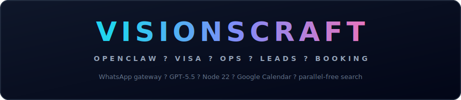

<p align="center">
  
</p>

<p align="center">
  
  
  
  
  
  
</p>

<p align="center">
  <strong>Production AI agency growth on WhatsApp</strong> — dual agents for inbound leads, booking, B2B research, and founder briefings.
</p>

<p align="center">
  <a href="#quick-start">Quick start</a> ·
  <a href="#agents">Agents</a> ·
  <a href="#routing">Routing</a> ·
  <a href="#project-layout">Project layout</a> ·
  <a href="#docs">Docs</a>
</p>

---

## Quick start

<a id="quick-start"></a>

**Requirements:** Windows · Node **22.19+** · OpenClaw **2026.6.6+** · OpenAI key in `~/.openclaw/.env`

```powershell
git clone https://github.com/Atif1299/VisionsCraft-OpenClaw-Visa-Ops-dual-agent-setup.git
cd VisionsCraft-OpenClaw-Visa-Ops-dual-agent-setup

# Copy openclaw.example.json → ~/.openclaw/openclaw.json (edit paths)
powershell -ExecutionPolicy Bypass -File .\scripts\sync-workspaces.ps1
powershell -ExecutionPolicy Bypass -File .\scripts\cleanup-live-workspace.ps1

start-gateway.bat

powershell -ExecutionPolicy Bypass -File .\scripts\setup-cron-jobs.ps1
```

**Health check:**

```powershell
openclaw gateway status
openclaw channels status
openclaw agents list --bindings
```

Dashboard: http://127.0.0.1:18789/

Full install: [SETUP.md](./SETUP.md) · Calendar: [CALENDAR-SETUP.md](./CALENDAR-SETUP.md)

---

## Agents

<a id="agents"></a>

| Agent | Workspace | Audience | Role |
|-------|-----------|----------|------|
| **Visa** | `workspace/` | Public WhatsApp | Lead capture, qualification, booking |
| **Ops** | `workspace-ops/` | Founder phones | B2B research, briefings, outreach drafts |

Shared knowledge: `knowledge/` (ICP, case studies, pricing, templates)

---

## Routing

<a id="routing"></a>

| Sender | Agent |
|--------|-------|
| Founder phones (`+923234065995`, `+923121365995`) | **Ops** |
| Everyone else | **Visa** |

Only founder numbers go in `bindings` → Ops. Other numbers (leads, testers) must stay off that list.

After config or SOUL changes: sync → restart gateway → **session reset** on old chats.

Template: [openclaw.example.json](./openclaw.example.json)

---

## Daily ops

```text
start-gateway.bat          # keep running
```

After editing this repo:

```powershell
powershell -ExecutionPolicy Bypass -File .\scripts\sync-workspaces.ps1
powershell -ExecutionPolicy Bypass -File .\scripts\cleanup-live-workspace.ps1
```

| Cron job | Schedule | Agent |
|----------|----------|-------|
| Founder brief | 9:00 AM PKT daily | Ops |
| B2B research | Mon 10:00 AM PKT | Ops |

---

## Project layout

<a id="project-layout"></a>

```
├── workspace/              # Visa — SOUL, skills, calendar
├── workspace-ops/          # Ops — research, briefing
├── knowledge/              # ICP, case studies, offer
├── scripts/                # sync, cron, backup
├── assets/readme-banner.svg
└── openclaw.example.json
```

**Live only (gitignored):** `~/.openclaw/openclaw.json`, `.env`, `leads.jsonl`, `bookings.jsonl`, `prospects.jsonl`

---

## Docs

<a id="docs"></a>

| Doc | Purpose |
|-----|---------|
| [SETUP.md](./SETUP.md) | Full install & troubleshooting |
| [VALIDATION.md](./VALIDATION.md) | Phases 1–4 validation |
| [CRON-SETUP.md](./CRON-SETUP.md) | Cron & pairing |
| [GCP-MIGRATION.md](./GCP-MIGRATION.md) | Future cloud hosting |

---

<p align="center">
  <sub>VisionsCraft · Production AI — agents, RAG, automation</sub>
</p>
